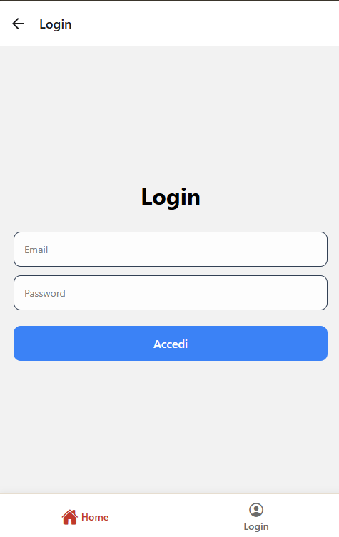
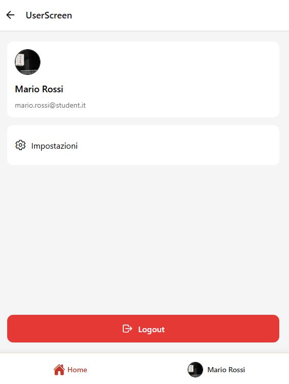
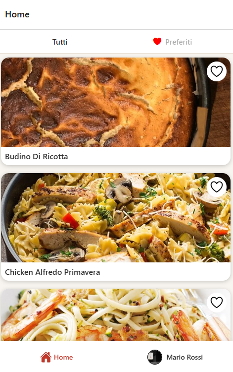
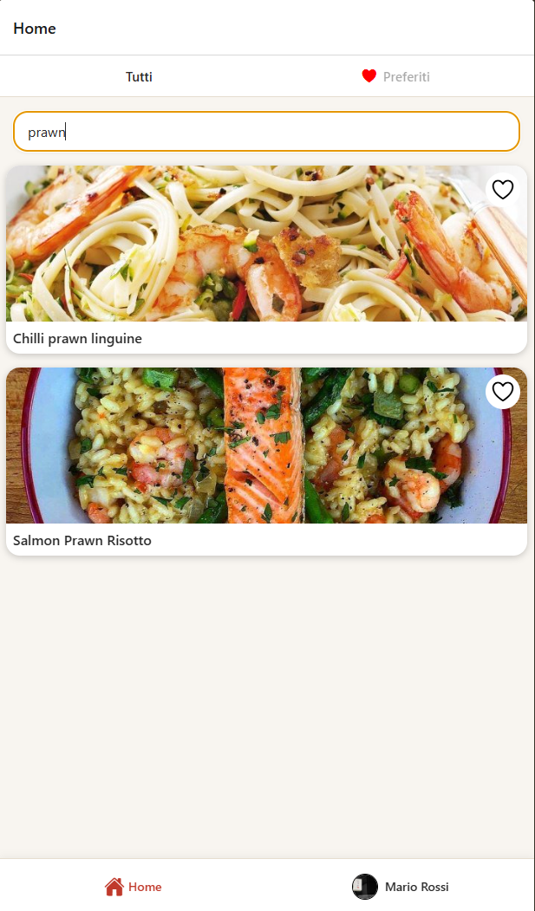
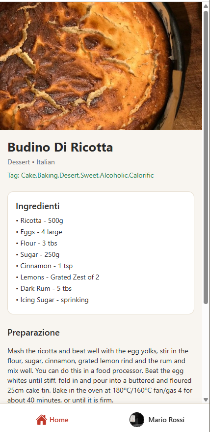
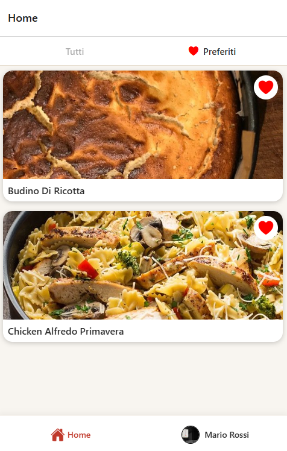
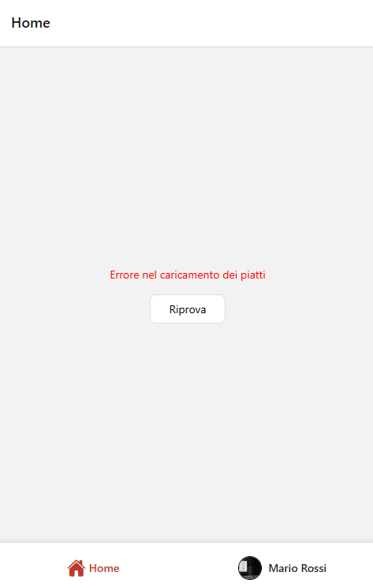
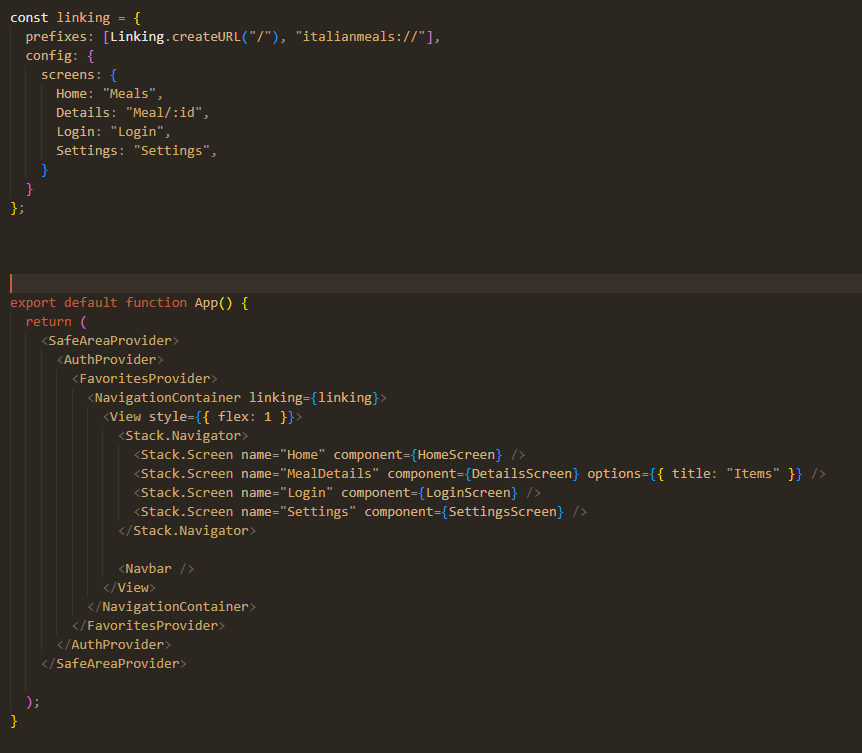

# Progress - Italian Meals App

**Studente:** Fabio Gentile 
**Repo:** https://github.com/fabiogentile-gif/ItalianMealsAPP 
**Ultimo aggiornamento:** 2026-07-08

## Schermate implementate

| Schermata      | Stato   | Screenshot                                          |
| -------------- | ------- | --------------------------------------------------- |
| Login          | ✅  |            |
| Header profilo |✅|        |
| Lista piatti   |  ✅    |             |
| Ricerca        |    ✅    |         |
| Dettaglio      |     ✅    |       |
| Preferiti      |     ✅    |    |
| Impostazioni   |     ✅    |  |
| Errore + Retry |    ✅     |           |
| Deep link      |    ✅     |     |

## Google Doc (lab 13–19)

**Link:** https://docs.google.com/document/d/1RXdJJVh4GlMYAngYksM9MLcUvdgkYoO3lizdgMCK36Y/edit?tab=t.twgpr3gmlcqs#heading=h.c3r0kqx87q1r

Uno screenshot per lab **13–19** (come avete fatto per i lab **01–11** alla verifica intermedia).

## Note

- Cosa manca per la consegna finale:
- Scelta stato globale:
- Deep link: http://localhost:8081/Meal/52961

## Utenti mock (login di test)

| Email                     | Password    |
| ------------------------- | ----------- |
| mario.rossi@student.it    | React2026!  |
| giulia.bianchi@student.it | Expo2026!   |
| luca.verdi@student.it     | Mobile2026! |

---

## CHECKLIST

- [x] Repository su GitHub (tuo account)
- [x] App avvia con `npx expo start` senza errori
- [x] Login funziona con i 3 utenti mock
- [x] Dopo login: avatar rotondo + nome utente visibili (lab 07)
- [x] Lista piatti da API italiana con stati `loading` / `error` / `success`
- [x] Dettaglio con endpoint `lookup.php?i={idMeal}`
- [x] Ricerca sulla lista
- [x] Preferiti salvati in AsyncStorage (`app:v1:favs`)
- [x] Navigazione Lista → Dettaglio → Impostazioni + logout
- [x] Deep linking (lab 14): URL `exp://` apre dettaglio con `idMeal` valido
- [x] Retry su errore API
- [x] Stato globale (Context / Zustand) per sessione o preferiti
- [x] Almeno 2 accorgimenti di accessibilità
- [x] File `PROGRESS.md` con tutti gli screenshot richiesti
- [x] Google Doc con screenshot lab 13–19 + link inserito in `PROGRESS.md`