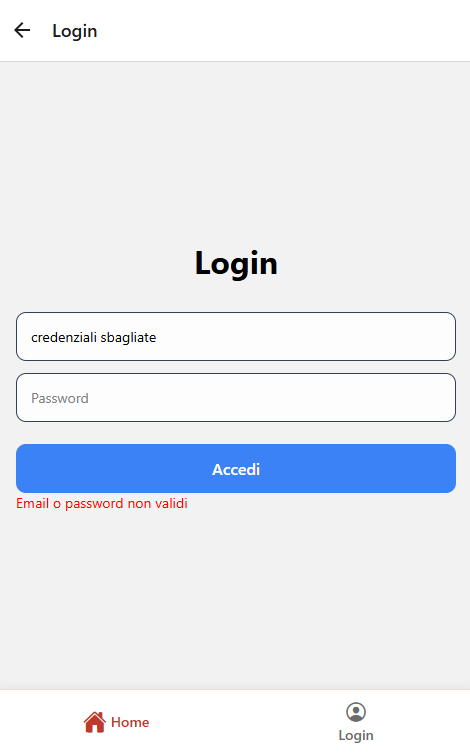
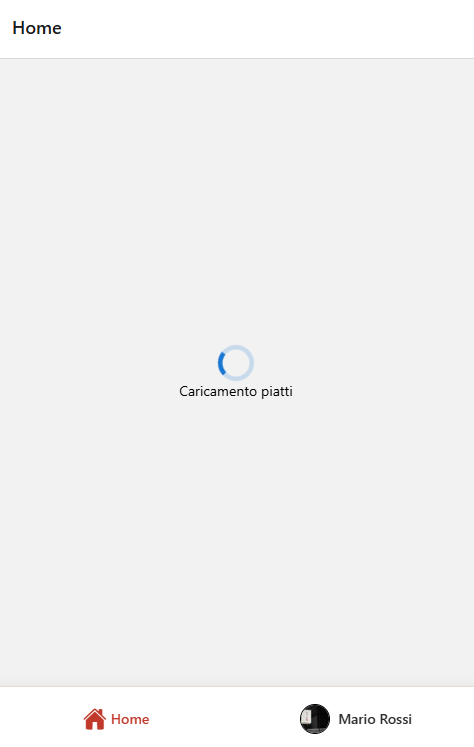
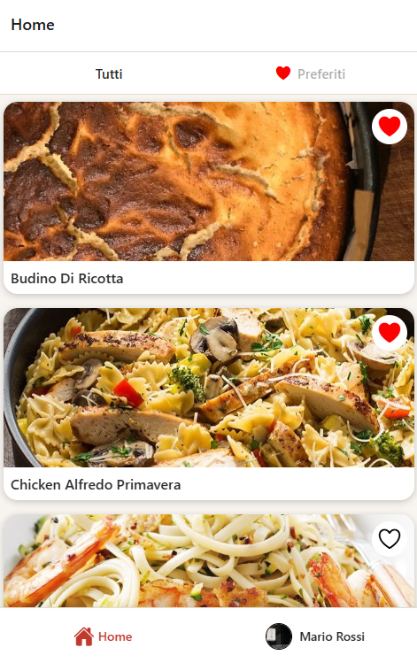
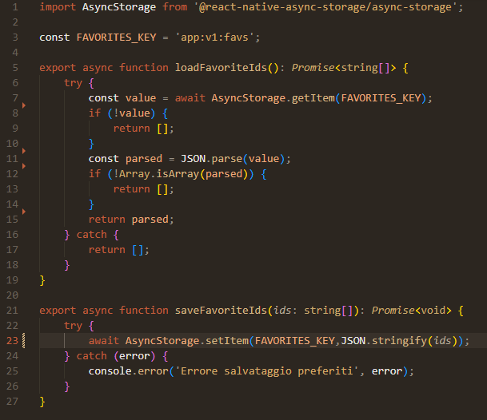

# PROGRESS

Ogni schermata deve avere uno screenshot inserito qui sotto.

---

## 1. Login
**Descrizione richiesta:**
Form controllato; accesso solo con credenziali mock valide; messaggio errore se credenziali sbagliate.

**Screenshot:**

---

## 2. Header profilo
**Descrizione richiesta:**
Dopo login: avatar rotondo (Image con borderRadius + overflow hidden) e nome utente loggato. Visibile in lista o impostazioni.

**Screenshot:**

---

## 3. Lista piatti
**Descrizione richiesta:**
FlatList da API italiana; stati: loading / error / success / empty.

**Screenshot:**

**Note:**
- [ c'è anche in caso *empty* ma non sono riuscito a replicarlo ]

---

## 4. Ricerca / filtro
**Descrizione richiesta:**
Campo testo controllato che filtra la lista.

**Screenshot:**

[INSERIRE SCREENSHOT]

**Note:**
- [ ]

---

## 5. Dettaglio
**Descrizione richiesta:**
Dati da lookup.php?i={idMeal}; immagine, titolo, istruzioni o ingredienti.

**Screenshot:**

[INSERIRE SCREENSHOT]

**Note:**
- [ ]

---

## 6. Preferiti
**Descrizione richiesta:**
Toggle preferito con persistenza AsyncStorage (app:v1:favs).

**Screenshot:**

---

## 7. Impostazioni
**Descrizione richiesta:**
Logout (ritorno login), avatar + nome utente, eventuale tema.

**Screenshot:**

**Note:**
- [  Premere sul bottone *Logout* riporta alla pagina di login eliminando la sessione dell'utente ]

---

## 8. Stato errore
**Descrizione richiesta:**
Errore rete/API + pulsante Retry.

**Screenshot:**

---

## 9. Accessibilità
**Descrizione richiesta:**
Almeno 2 accorgimenti (es. accessibilityLabel su pulsanti/card).

**Screenshot:**

[INSERIRE SCREENSHOT]

**Note:**
- [ ]

---

## 10. Deep link
**Descrizione richiesta:**
Dettaglio piatto aperto via URL (meal/:idMeal, lab 14). Terminale con comando exp:// riuscito.

**Screenshot:**

[INSERIRE SCREENSHOT]

**Note:**
- [ se *http://localhost:8081/MealDetails?idMeal=52961* si cambia l'id dall'url in qualcosa che non esiste restiuisce errore (non ho potuto fare il comando siccome non ho l'emulatore) ]